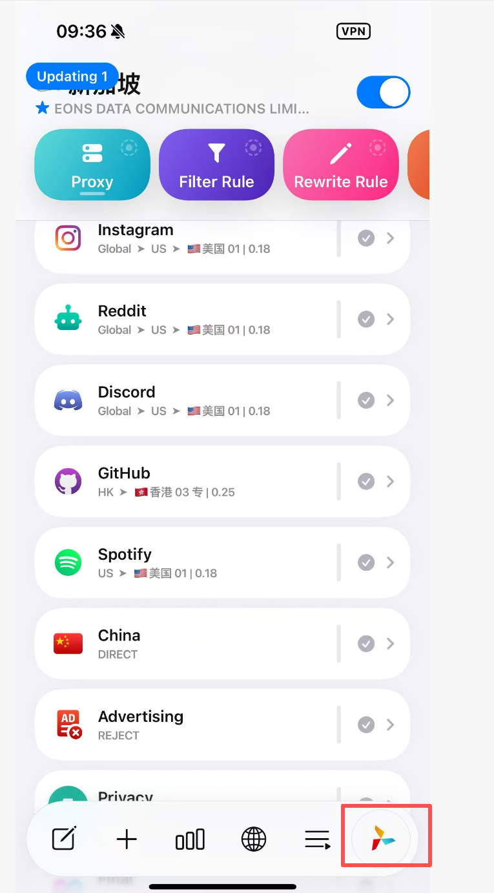
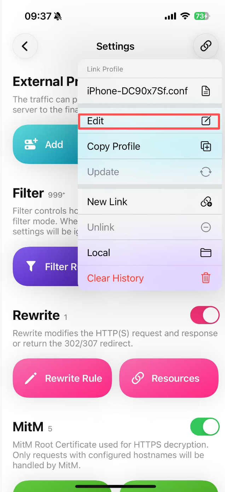
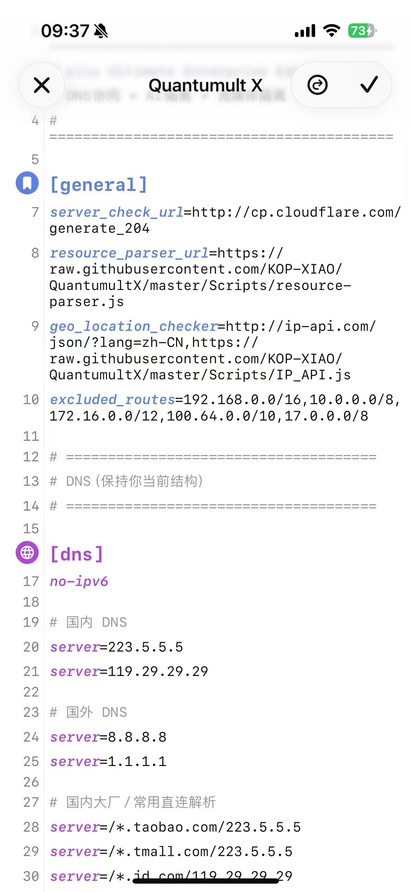

# Quantumult X 配置

> **sliu's config** — 一份开箱即用的 Quantumult X 配置，涵盖 DNS 分流、AI 服务隔离、流媒体/社交独立策略、广告拦截与电竞优化。

## 功能特性

### DNS 分流
- 国内站点（淘宝、京东、QQ、B站等）走阿里/腾讯 DNS（`223.5.5.5` / `119.29.29.29`）
- 海外站点（Google、AI 服务、社交平台）走 Google DNS（`8.8.8.8`）

### AI 服务独立路由
每个 AI 服务拥有独立策略组，互不干扰：

| 服务 | 策略组 | 默认地区 |
|------|--------|----------|
| ChatGPT / OpenAI | AI-SG | 新加坡 |
| OpenAI API | AI-API | 新加坡 |
| Claude / Anthropic | Claude | 新加坡 |
| Gemini | AI-US | 美国 |
| Grok | AI-US | 美国 |
| DeepSeek | AI-SG | 新加坡 |
| Perplexity | AI-SG | 新加坡 |
| Copilot | AI-SG | 新加坡 |

### 流媒体 & 社交平台
每个服务独立策略组，可单独选择地区节点：
- **流媒体**：YouTube、Netflix、Spotify
- **社交**：Twitter/X、Facebook、Instagram、Reddit
- **通讯**：Telegram、WhatsApp、Discord
- **开发**：GitHub

### 广告拦截
- 远程规则列表：来自 [blackmatrix7/ios_rule_script](https://github.com/blackmatrix7/ios_rule_script)
- 本地关键词拦截：远程列表失效时自动兜底

### 其他
- **Apple / Microsoft**：默认直连，可手动切换代理
- **电竞优化**：亚洲低延迟自动选择（港/日/新）
- **国内流量**：GeoIP + ChinaMax 规则直连
- **兜底规则**：未匹配流量走 Global 代理

---

## 策略组架构

```
Global（Auto / US / HK / JP / SG / TW / DIRECT）
  |
  |-- AI-SG ........... ChatGPT、DeepSeek、Perplexity、Copilot（默认新加坡）
  |-- AI-US ........... Gemini、Grok（默认美国）
  |-- AI-API .......... OpenAI API 调用（默认新加坡）
  |-- Claude .......... Claude / Anthropic（默认新加坡）
  |
  |-- YouTube ......... YouTube + CDN
  |-- Netflix ......... Netflix
  |-- Spotify ......... Spotify
  |-- Media ........... 其他海外流媒体
  |
  |-- Twitter ......... Twitter / X
  |-- Facebook ........ Facebook
  |-- Instagram ....... Instagram
  |-- Reddit .......... Reddit
  |-- Discord ......... Discord
  |-- GitHub .......... GitHub
  |
  |-- Telegram ........ Telegram
  |-- WhatsApp ........ WhatsApp + IP 段
  |-- Google .......... Google 服务
  |-- Apple ........... Apple（默认直连）
  |-- Microsoft ....... Microsoft（默认直连）
  |
  |-- Asia-LowLatency . 电竞低延迟（自动测速）
  |-- China ........... 国内（直连）
  |-- Advertising ..... 广告拦截（REJECT）
  |-- Privacy ......... 隐私追踪拦截（REJECT）
  |-- Final ........... 兜底（Global / DIRECT）
```

---

## 导入教程

### 第一步：进入设置

打开 Quantumult X，点击右下角的**风车图标**进入设置页面。



### 第二步：编辑配置

点击右上角的**链接图标**，选择 **Edit**，进入配置编辑器。



### 第三步：粘贴配置

> **新手建议**：直接清空原有内容，将 [`QuantumultX.conf`](QuantumultX.conf) 中的全部内容粘贴进去，点击右上角 **对勾** 保存。
>
> **熟悉规则的用户**：可以根据自己的需求，在配置文件基础上自行增删规则，不必完全照搬。

⚠️ **关于 MitM 部分的重要提醒**：

本配置文件 `[mitm]` 部分只写了 `hostname = sub.store`。粘贴配置后，请注意：

- **不要删除**你原有的 `passphrase` 和 `p12` 字段 — 这是你本机生成的 MitM 证书信息，删除后 MitM/重写功能将失效。
- **不要泄露**你的 `passphrase` 和 `p12` 给任何人 — 这相当于你的私钥，泄露会有安全风险。
- 正确做法：保留你自己的 `passphrase`、`p12` 内容，只将 `hostname` 行合并即可。



### 第四步：替换订阅链接

找到 `[server_remote]` 中的这一行：

```
换成自己的订阅链接🔗,tag=Nodes,update-interval=172800,opt-parser=true,enabled=true
```

将 `换成自己的订阅链接🔗` 替换为你自己的机场订阅地址。

### 第五步：开启 MitM（可选）

如需使用重写/MitM 功能，请在设置中的 **MitM** 模块生成并安装 CA 证书。

---

## 规则优先级

规则按以下顺序匹配（优先级从高到低）：

1. **本地规则**（`[filter_local]`）— AI、WhatsApp、YouTube、社交平台防抢规则
2. **远程规则**（`[filter_remote]`）— blackmatrix7 完整规则列表
3. **GeoIP CN** — 国内流量直连
4. **Final** — 未匹配流量走 Global 代理

---

## 致谢

- 规则列表：[blackmatrix7/ios_rule_script](https://github.com/blackmatrix7/ios_rule_script)
- 策略图标：[Koolson/Qure](https://github.com/Koolson/Qure)
- 资源解析器：[KOP-XIAO/QuantumultX](https://github.com/KOP-XIAO/QuantumultX)

## 许可证

MIT
